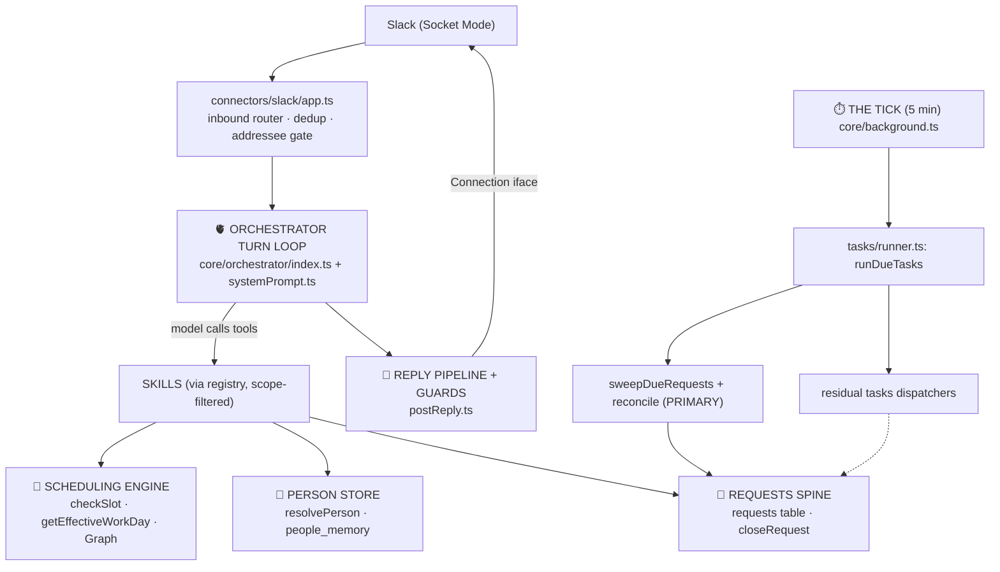

# Maelle — Architecture Map

> Living reference for the core architecture. Current version: `package.json`; current implementation: the source paths below. Documentation reconciliation does not establish deployment.
> For version-by-version history see `CHANGELOG.md`; for deep subsystem detail see `.claude/memory/project_architecture.md`.

## The one-sentence model

**Admitted messages reach the orchestrator; requests track asynchronous decisions and outreach, while tasks materialize routines and calendar checks. The five-minute background pipeline drives scheduled work, with separate inbound polling and recovery loops. Reply callers select the appropriate output-gate leg.**

## Message → reply (the hot path)

---

## THE BACKBONE — core spines

### 1. 🧵 Requests spine — *the* backbone
`core/requests/*` · `db/requests.ts` · types in `core/requests/types.ts`
The `requests` table owns approval, outreach, reminder, follow-up, research and social-outreach lifecycles. Fields: `kind`, `state`, `phase`, timer (`next_check_at`/`next_check_handler`), return address (`origin_channel`/`origin_thread_ts`). `logged` rows record completed activity without opening a decision.
- **Invariant:** the request row is the source of truth for open/waiting-on/closed request work. The `outreach_jobs` side table is payload-only; its `status` column was dropped. The old coordination subsystem is removed.
- **`closeRequest.ts` owns terminal transitions** — idempotent, cascades to children, clears the timer, audit-logged. Requests are retained; the former age-pruning mechanism was removed by owner ruling in 4.5.4. Failed requester relays have their own retry contract; closure alone does not prove notification delivery.

### 2. ✅ Approval flow — a `kind` of request
`tasks/skill.ts` (`create_approval`/`resolve_approval`) · `core/requests/resolver.ts` · `core/requests/deferredActionReplay.ts`
An approval is `kind='approval'` on the spine. **Deferred-action replay** ("redirect-token"): the tool + args that hit a rule are stamped on the request. The resolver records the decision and replays with preserved authority and origin scope. Completed, tracked, failed and unconfirmed effects remain distinct; a resolved decision alone is not a completed action. See the canonical architecture memory's approval trace.

### 3. 🫀 Orchestrator turn loop — the engine
`core/orchestrator/index.ts` · `core/orchestrator/systemPrompt.ts`
Every message → assemble system prompt (date, prefs, people memory, pending approvals, persona) → Claude tool loop → skills → reply pipeline. Tool payload is **scope-filtered per turn** (`classifyTurn` picks scopes; `registry.ts` maps scope→tools) to keep the cached prefix small.

### 4. ⏱️ The tick + async execution layer — the heartbeat
`core/background.ts` (single 5-min timer) → `tasks/runner.ts:runDueTasks`
`runDueTasks` runs **(a) `sweepDueRequests()` — the requests-spine sweep** and **(b)** due `tasks` rows via the dispatcher map. Startup recovery and missed-message catch-up also begin in `background.ts`; catch-up has a separate timer and socket watermark.
> **Two complementary stores:** `create_task` reminders/follow-ups/research use requests and their `next_check_handler`; `tasks` retains engine jobs and owner-visible tracking. The current dispatcher registry contains only `routine` and `calendar_fix`. Automatic summary followups are retired; startup cancels only nonterminal rows of the exact legacy summary task type, without replaying sends or cancelling generic outreach. Summary drafting, editing, sharing and action-item content remain.

### 5. 🚪 Reply pipeline + guards — the output spine
`connectors/slack/postReply.ts` calls gate policy in `utils/guards/runOutputGates.ts`.
Slack policy derives and logs authenticated owner action, colleague readability and voice audience before selecting the checks. Email has a fixed external-reader leg. Claim correction is tool-less; date correction uses extracted pairs. Failures follow each guard's contract, not a blanket fail-open rule: optional codas require clear checks and drop on failure, while ordinary replies retain their existing fallback behavior. Inbound **addresseeGate** and **imageGuard** belong to SlackMaster. *(No `coordGuard` — removed.)*

### 6. 📅 Scheduling / booking engine — the calendar backbone
`skills/meetings.ts` → `skills/meetings/ops.ts` → `utils/scheduleRules.ts` + `utils/workHours.ts` → `connectors/graph/calendar.ts`
Two chokepoints keep search and booking in agreement:
- **`checkSlot`** — the shared "is this slot OK?" validator used by search, create and move paths.
- **`getEffectiveWorkDay` / `…ForInstant`** — the ONE work-day resolver: yaml base ⊕ per-date `owner_schedule_overrides`, fail-safe to yaml.
Supporting: `floatingBlocks`, `categoryRules`, `meetingProtection`, `weTimeResolver` (travel dual-clock).

### 7. 👤 Person store — the identity backbone
`db/people.ts` · `memory/peopleMemory.ts` · `core/assistant.ts`
One `people_memory` table for everyone (internal / external / `self`), keyed by surrogate `person_id`. **`resolvePerson({slackId?,email?,name?})` is the identity chokepoint** (find-or-create-or-merge: slack→email→fuzzy-name). Per-person operational facts live as `.md` files.

### 8. 🔌 Connection / transport layer
`connections/types.ts` (interface) · `connections/registry.ts` · `connections/slack/*` · `connections/email/*` · inbound in `connectors/slack/*` + `connectors/email/*`
Outbound messaging goes through the `Connection` interface; **skills never send through `connectors/slack/` directly**. **The interface and the registry are Handyman's** (reversed 2026-08-11; ruled ownerless 2026-08-01, until Handyman's seams-between-lanes facet existed to hold it); the per-transport folders still belong to their own lanes. Email shipped in 4.3.0; WhatsApp is the next seam. Skills use the separate `connectors/graph/calendar.ts` backend for calendar operations.

### 9. 🧩 Skills registry — how capabilities plug in
`skills/registry.ts` · `skills/types.ts`
`CORE_MODULES` (always on): **AssistantSkill (memory), OutreachCoreSkill, TasksSkill, CronsSkill (routines)**. Togglable via YAML: meetings, calendar-health, social, summary, knowledge, search, venue, news. Per-turn scope filtering trims the tool list.

---

## PERIPHERAL — runs *outside* the core spines

| Group | Items | Why peripheral |
|---|---|---|
| **Leaf skills** | `news`, `venue`, `knowledge`, `summary`, `general`(search) | Model-invoked tool bundles; nothing depends on them |
| **Social engine** | `core/social/*` + `memory/capturePass` | A deterministic pre/post-pass wrapping the loop, gated on `skills.social` (off by default) — middleware, not a tool bundle |
| **I/O adapters** | `voice/*` (Whisper/TTS), `vision/*` (image ingest) | Side channels into a turn |
| **Task dispatcher *handlers*** | `tasks/dispatchers/{routine,calendarFix}.ts` | Per-type logic plugged into the core runner (#4) |
| **Cross-cutting utils** | Formatters, `rateLimit`, `turnCache`, `toolCallCache`, `usageLog`, `logger` | Helpers include process-local state and caches; they are not all pure functions |
| **Owner and operational scripts** | `scripts/` | DB/maintenance/debug tools, release checks, framework tooling and the long-running deploy watcher |
| **Dormant** | `connectors/whatsapp.ts` | Inert until a WhatsApp transport is configured |

**"Is it core?" test:** if removing it breaks the *lifecycle of work* (requests), the *turn* (orchestrator), the *clock* (tick), *what's said* (guards), or *when/who* a meeting is booked (scheduling / person store) → backbone. If the loop *calls* it or *uses* it as a formatter → peripheral.

---

## Known architectural debt / consolidation candidates
- **Task cleanup history:** the vestigial request-kind task values were removed o#192 (2026-08-03); `social_decay` and `social_ping_rank_check` dispatchers/types were removed gh#198 (2026-08-15). These are not pending cleanup work. The tasks table still supports routines and calendar checks.
- **Dead tables dropped** (v3.7.x cleanup): `approvals`, `cron_schedules`, `assistant_threads` — now `DROP TABLE IF EXISTS` on boot, no recreate.
