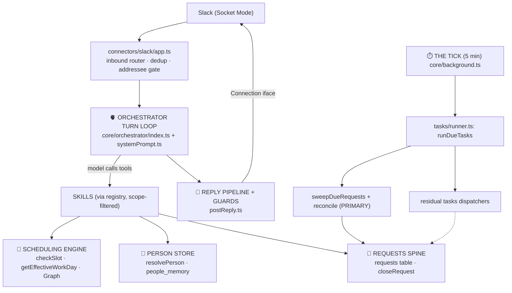

# Maelle — Architecture Map

> Living reference for the core architecture. Snapshot: **v3.7.3** · **159** `src` files · **~59.3k** LOC · **62** tool-schema defs.
> For version-by-version history see `CHANGELOG.md`; for deep subsystem detail see `.claude/memory/project_architecture.md`.

## The one-sentence model

**Every inbound message runs one orchestrator turn; anything that can't finish in that turn becomes a row on the requests spine; a single 5-minute tick drives everything asynchronous; every owner-facing word leaves through the guard pipeline.**

## Message → reply (the hot path)

---

## THE BACKBONE — core spines

### 1. 🧵 Requests spine — *the* backbone
`core/requests/*` · `db/requests.ts` · types in `core/requests/types.ts`
One `requests` table owns the **lifecycle** of every multi-step unit of work (coord, outreach, approval, reminder, follow-up, research). Fields: `kind`, `state` (`awaiting_owner`/`awaiting_colleague`/`in_flight` → `resolved`/`cancelled`/`expired`), `phase`, timer (`next_check_at`/`next_check_handler`), return address (`origin_channel`/`origin_thread_ts`).
- **Invariant:** the request row is the single source of truth for open/waiting-on/closed. The `outreach_jobs` side table is payload-only; its `status` column is vestigial by design. (`coord_jobs` no longer exists — the coord subsystem it backed was removed in 3.5.0.)
- **`closeRequest.ts` is the ONLY terminal path** — idempotent, cascades to children, clears the timer, audit-logged. `reconcile.ts` kills orphans + prunes terminal rows >30d.

### 2. ✅ Approval flow — a `kind` of request
`tasks/skill.ts` (`create_approval`/`resolve_approval`) · `core/requests/resolver.ts` · `core/requests/deferredActionReplay.ts`
An approval is `kind='approval'` on the spine. **Deferred-action replay** ("redirect-token"): the tool + args that hit a rule are stamped on the request; on approve, the resolver re-invokes that exact tool with the override flag and returns the real booked facts. Errors propagate → the request stays `awaiting_owner` (no phantom "approved").

### 3. 🫀 Orchestrator turn loop — the engine
`core/orchestrator/index.ts` · `core/orchestrator/systemPrompt.ts`
Every message → assemble system prompt (date, prefs, people memory, pending approvals, persona) → Claude tool loop → skills → reply pipeline. Tool payload is **scope-filtered per turn** (`classifyTurn` picks scopes; `registry.ts` maps scope→tools) to keep the cached prefix small.

### 4. ⏱️ The tick + async execution layer — the heartbeat
`core/background.ts` (single 5-min timer) → `tasks/runner.ts:runDueTasks`
`runDueTasks` runs **(a) `sweepDueRequests()` — the requests-spine sweep (PRIMARY)** and **(b)** due `tasks`-table rows via the dispatcher map. All proactive/async work hangs off this one clock. Boot recovery (missed-message catch-up) also starts here, scoped to a socket watermark.
> **Note — two complementary systems, NOT redundancy.** The requests spine owns **lifecycle + timers** (`create_task` actually calls `createRequest`; reminders / follow-ups / research / coord / outreach-timers all live on the spine via `next_check_handler`). The `tasks` table is the **owner-facing work LEDGER + recurring-chore substrate**: it backs the daily brief (`getBriefableTasks`), the owner task list (`get_my_tasks` / `getOpenTasksForOwner`), colleague/thread context injection (`getTasksForPerson` / `getActiveJobsForThread`), the ✅-completion react, and routine materialization. Live task rows are created by routines, outreach (a visibility record), summary follow-ups, `calendar_fix`, and `social_decay`. The only genuine dead weight: 4 vestigial `TaskType` values (`coordination` / `reminder` / `follow_up` / `research` — now request *kinds*), the `social_ping_rank_check` drain, and a stale `types.ts` header. Deleting the whole table is **not viable** without re-hosting the brief/ledger on the spine — large effort, low payoff.

### 5. 🚪 Reply pipeline + guards — the output spine
`connectors/slack/postReply.ts` + 6 guards in `utils/`
Every owner-facing reply: normalize (`formatForSlack`/`textScrubber`) → **claimChecker** (false "I did it" claims) → **dateVerifier** (wrong weekday/date, deterministic correction) → **securityGate** (AI/bot self-reveal) + **humanGate** (Maelle-as-infrastructure framing). Inbound-side guards: **addresseeGate** (MPIM "is this for me") + **imageGuard** (image-text injection). Each = one concern, one stage, fails open. *(No `coordGuard` — removed.)*

### 6. 📅 Scheduling / booking engine — the calendar backbone
`skills/meetings.ts` → `skills/meetings/ops.ts` → `utils/scheduleRules.ts` + `utils/workHours.ts` → `connectors/graph/calendar.ts`
Two chokepoints keep search and booking in agreement:
- **`checkSlot`** — the ONE "is this slot OK?" validator (rules 0–9). Search, create, move, coord all call it.
- **`getEffectiveWorkDay` / `…ForInstant`** — the ONE work-day resolver: yaml base ⊕ per-date `owner_schedule_overrides`, fail-safe to yaml.
Supporting: `floatingBlocks`, `categoryRules`, `meetingProtection`, `weTimeResolver` (travel dual-clock).

### 7. 👤 Person store — the identity backbone
`db/people.ts` · `memory/peopleMemory.ts` · `core/assistant.ts`
One `people_memory` table for everyone (internal / external / `self`), keyed by surrogate `person_id`. **`resolvePerson({slackId?,email?,name?})` is the identity chokepoint** (find-or-create-or-merge: slack→email→fuzzy-name). Per-person operational facts live as `.md` files.

### 8. 🔌 Connection / transport layer
`connections/types.ts` (interface) · `connections/registry.ts` · `connections/slack/*` · `connections/email/*` · inbound in `connectors/slack/*` + `connectors/email/*`
Outbound goes through the `Connection` interface; **skills never import from `connectors/`**. **The interface and the registry are the shared spine — no lane owns them** (owner's ruling 2026-08-01); the per-transport folders belong to their lanes. Email shipped in 4.3.0; WhatsApp is the next seam. `connectors/graph/calendar.ts` is the Outlook backend (not a messaging Connection).

### 9. 🧩 Skills registry — how capabilities plug in
`skills/registry.ts` · `skills/types.ts`
`CORE_MODULES` (always on): **AssistantSkill (memory), OutreachCoreSkill, TasksSkill, CronsSkill (routines)**. Togglable via YAML: meetings, calendar-health, social, summary, knowledge, search, venue, news. Per-turn scope filtering trims the tool list.

---

## PERIPHERAL — runs *outside* the core spines

| Group | Items | Why peripheral |
|---|---|---|
| **Leaf skills** | `news`, `venue`, `knowledge`, `summary`, `general`(search) | Model-invoked tool bundles; nothing depends on them |
| **Social engine** | `core/social/*` + `memory/capturePass` | A deterministic pre/post-pass wrapping the loop, gated on `skills.social` (off by default) — middleware, not a tool bundle |
| **I/O adapters** | `voice/*` (Whisper/TTS), `vision/*` (image ingest) | Side channels into a turn |
| **Task dispatcher *handlers*** | `tasks/dispatchers/{routine,calendarFix,summaryActionFollowup,socialDecay,socialPingRankCheck}.ts` | Small per-type logic plugged into the core runner (#4). `routine` is semi-core (materializes user routines) |
| **One-off utils** | `textScrubber`, `formatForSlack`, `toolStatusText`, `calendarListingFormat`, `displaySubject`, `extractJson`, `rateLimit`, `turnCache`, `toolCallCache`, `usageLog`, `logger` | Pure formatters/helpers; no state, no lifecycle |
| **Owner scripts** | `scripts/*.cjs/.mjs/.ts` (22 files) | One-off DB/maintenance/debug tools, outside `src/`; never in the request path. Live ones: `db-query.cjs`, `auto-build.mjs`+`auto-triage-bug.mjs` (CI), `measure-prompts`/`_dump-prompts` |
| **Dormant** | `connectors/whatsapp.ts` | Inert until a WhatsApp transport is configured |

**"Is it core?" test:** if removing it breaks the *lifecycle of work* (requests), the *turn* (orchestrator), the *clock* (tick), *what's said* (guards), or *when/who* a meeting is booked (scheduling / person store) → backbone. If the loop *calls* it or *uses* it as a formatter → peripheral.

---

## Known architectural debt / consolidation candidates
- **Tasks table micro-cleanup** (small, safe — NOT a full-table deletion): retire the `social_ping_rank_check` drain once emptied. The table itself is the live owner-facing ledger + brief substrate — the spine owns timers, tasks owns visibility; that split is deliberate (v3.1). (The 4 vestigial `TaskType` values and the stale `types.ts` header this bullet used to name were removed o#192, 2026-08-03.)
- **Dead tables dropped** (v3.7.x cleanup): `approvals`, `cron_schedules`, `assistant_threads` — now `DROP TABLE IF EXISTS` on boot, no recreate.
